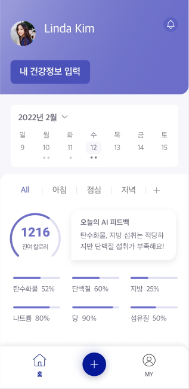
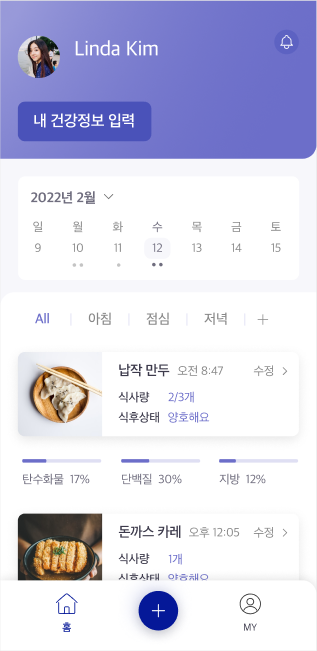
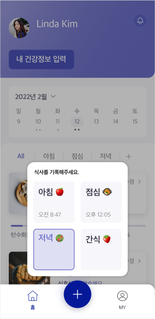
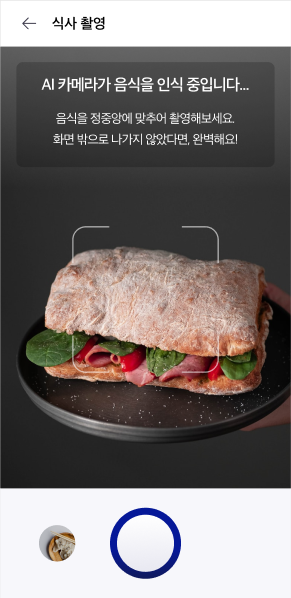
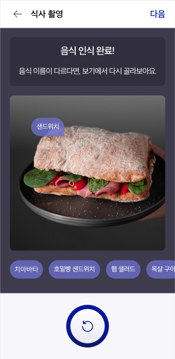
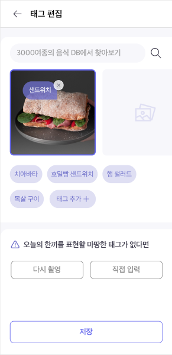

# 삼육대학교 SW프로젝트 - CNAI 식단관리앱

## 팀원: 김명진, 서민석, 백정훈, 최인규

 프론트 엔드: 김명진, 서민석, 백정훈, 최인규

## 프로젝트 소개

- 수술이나 시술 후 식단관리를 필수적으로 해야 하는 환자들을 위한 식단관리 및 추천 플랫폼입니다. 환자의 수술 후 경과 관리에서 환자가 스스로 식단관리를 해야하는 경우 생기는 불편함을 식단관리 앱을 통해 개선해줍니다.
- 환자가 아니더라도 식단을 관리해야 하는 일반인들도 사용 가능하며 다이어트나 건강관리를 위한 식단관리에 사용 가능합니다.
- 아침, 점심, 저녁 등 식사나 간식을 할 때, 촬영을 통해 음식을 영양을 분석한 후 알맞은 정보를 제공해줍니다.

## 개발배경 및 필요성

- 사용자마다 식습관과 식단이 모두 다르기 때문에, 사용자 각각의 개인화된 식단관리 앱이 필요하다고 생각했습니다.
- 수술이나 시술 후 사용자가 식단관리를 해야 할 때, 이를 도와주는 앱이 상용화되어있지 않아 필요성을 느꼈습니다.
- 식단관리를 할 때, 식단에 대한 영양 분석이 앱을 통해 이루어지면 사용자가 체계적인 식단관리를 할 수 있어 사용자의 불편함을 개선할 수 있습니다.

## 작품의 특징 및 장점
- 환자가 스스로 식단관리를 할 때 식단의 전문적인 정보를 확인할 수 있다.
- 식단 기록 : 사용자가 자신의 식단을 기록하면 알맞은 AI피드백을 제공한다.
  >> 사용자는 AI피드백을 통해 식단의 문제점을 파악할 수 있다.
- 식단 영양 분석 : 촬영한 식단에 대한 영양을 분석하여 사용자에게 제공한다.
  >> 영양 분석을 통하여 필요한 영양 정보를 확인할 수 있다.

## 프로젝트 개발환경
|구분|항목|적용내역|
|-|-|-|
|OS|Android, iOS|Android, iOS에서 적용되게 구현|
|개발환경(IDE)|Visual Studio Code|앱의 기능적, 디자인적 개발을 위한 환경|
|개발도구|Expo|앱의 구현을 위한 도구|
|개발언어|React Native|앱의 기능, 디자인을 구현|

## CNAI 제공 와이어프레임 UI

## 최종 프로토타입 제작
- [■] 프로젝트 기한에 맞춰 프로토타입 제작 완료
- [■] 프로토타입을 시연하는 성과발표 진행
- [■] 시연 동영상 : https://youtu.be/haroVH1KZ9A

## 기대효과 및 활용분야
- 앱 사용 회원들의 전반적인 식단관리를 바탕으로 마케팅 기회 확보 및 식단관리 플랫폼 운영할 수 있습니다.
- 사용자에게 맞춘 식사 분류 및 피드백 AI 제공하여 식단관리의 어려움을 개선해줍니다.
- 수술이나 시술 후 식단관리를 필수적으로 해야 하는 환자들에게 스스로가 아닌 앱을 통해 식단관리를 하게 해줍니다.
- 식단관리 앱을 병원에서 사용하여 이용하는 타겟층에 대해 전문적인 지식을 보여주어 식단관리 앱의 가치를 높여줍니다.
