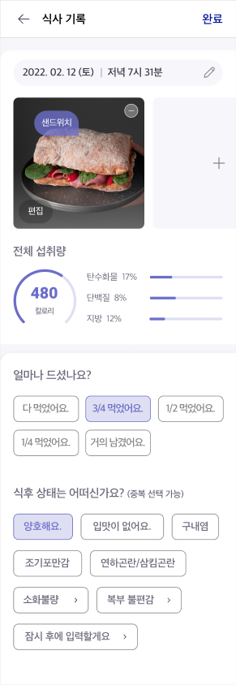

◈ 개발 중인 것을 main 브랜치에 직접 push 하지 말 것! ◈

# 삼육대학교 SW프로젝트 - CNAI 식단관리앱

## 팀원: 김명진, 서민석, 백정훈, 최인규

## 프론트 엔드: 김명진, 서민석, 백정훈, 최인규

## 백엔드: -

# 사용 방법

- 프로젝트 경로로 이동 후, 'npm install' 명령어를 입력하여 package.js에 명시된 모듈 자동으로 모두 설치
- 이후 'npm start' 명령어로 expo-cli 시작, 스마트폰에 expo 어플리케이션 설치
- 터미널에 뜨는 QR코드를 스마트폰으로 인식 후, 접속

## API 키 등 private 요소는 key.env 파일에 저장할 것

## CNAI 제공 와이어프레임 UI

## 기타 사항
- 프로토타입 어플리케이션이므로 일단은 백엔드는 진행하지 않음.
- ReactNative-cli는 개발환경 구축에 많은 어려움이 있으므로 Expo-cli로 진행

# 진행 상황
- [　] 각자 선택한 UI 코딩 후 22-05-01 오후 5시 오프라인 스터디 예정

